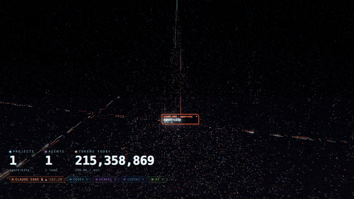

# Agent City

A cyberpunk city as your macOS wallpaper, lit up by the coding agents you have running.

Demo mode (`?demo=1`), sped up 3×. Inspired by [@internetphysics](https://x.com/internetphysics/status/2104305710079119649).

## What you see

- **Districts per installed harness**: the city is split into equal slices, one per harness that is installed (binary or app) and used in the last 30 days; with only Claude Code, the whole city is Claude's. Colours: Claude Code (orange), Codex (cyan), Hermes (violet), Gemini, Copilot, pi, opencode, Cursor, aider, amp, droid, goose, crush. `?districts=claude,codex` overrides.
- **Megatower per live session.** Height tracks the tokens it has burned. Working towers fire a beam and stream token packets to the LOCALHOST spire; idle towers dim.
- **Subagents** rise as satellite towers linked to their parent by light bridges (Claude `subagents/`, Codex `thread_spawn`, Hermes child sessions).
- **Whole-city activity** (windows, highway traffic, sky traffic, signage, bloom) scales with working agents and tokens per minute.

## Pieces
- `collector.py`: stdlib Python. Tails `~/.claude/projects`, `~/.codex/sessions`, `~/.hermes/state.db`, Copilot/pi/Gemini/opencode session dirs, and `ps` for other CLIs. Serves `/state` plus the web app on `127.0.0.1:8777`.
- `web/`: Three.js renderer (vendored, offline). `?demo=1` runs a scripted fake workload. Other params: `fps=30`, `res=1.25`, `rain=0`, `grain=0`, `labels=0`, `pad=110`, `districts=claude,codex`.
- `wallpaper/`: Swift host that pins a click-through WKWebView at desktop level on every screen and Space. The ⌬ menu-bar item toggles demo mode, reloads, or quits.

## Try it in a browser
Needs only Python 3:

    python3 collector.py      # then open http://127.0.0.1:8777  (or /?demo=1)

## Install as your wallpaper (macOS)
Needs Python 3 and the Xcode command-line tools (`swiftc`).

    ./install.sh              # build ~/Applications/AgentCity.app and install LaunchAgents
    ./install.sh uninstall

Logs go to `~/Library/Logs/agentcity-*.log`.

## Privacy
Everything stays on your machine. The collector reads local session files read-only and serves them only on `127.0.0.1`.
